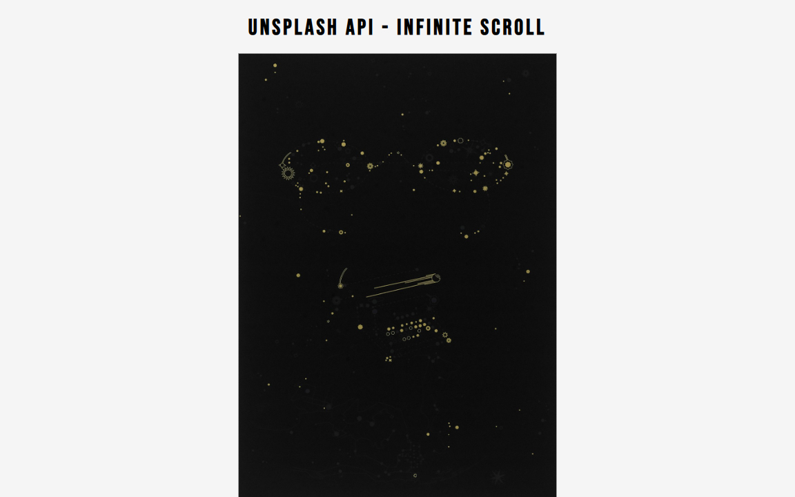

# Infinite Scroll | ZTM JS Web Projects Course

**Project 2/20**

This is a **dynamic image gallery** built with **HTML, CSS, and JavaScript** that uses the **Unsplash API** to fetch and display random images with **infinite scrolling**. When the user scrolls near the bottom of the page, more photos are automatically loaded.

> ⚠️ **Important:** You must use your own **Unsplash API key** to make this project work. Visit [Unsplash Developers](https://unsplash.com/developers) to register and obtain an API key.

---

## 📚 Table of contents

- [🔎 Overview](#overview)
  - [📸 Screenshot](#-screenshot)
  - [🔗 Links](#-links)
  - [📌 Features](#-features)
- [📦 Setup & Installation](#-setup--installation)
  - [1️⃣ Clone the Repository](#1️⃣-clone-the-repository)
  - [2️⃣ Add Your API Key](#2️⃣-add-your-api-key)
  - [3️⃣ Run the Project](#3️⃣-run-the-project)
- [🧠 My Process](#-my-process)
  - [🛠️ Built with](#️-built-with)
  - [🎓 What I Learned](#-what-i-learned)
  - [🔜 Next Project](#-next-project)
- [👤 Author](#-author)
  - [🌐 Connect with Me](#-connect-with-me)
  - [💻 Coding Profiles](#-coding-profiles)

---

## 🔎 Overview

### 📸 Screenshot



### 🔗 Links

 - 🔴 Live Demo - N/A *(To view the project, clone the repository and follow the [📦 Setup & Installation](#-setup--installation) instructions.)*
 - [🗂️ GitHub Repository](https://github.com/DalaScript/infinite-scroll)

### 📌 Features

 - ✅ Infinite Scroll to fetch more images on demand
 - ✅ Responsive layout for both desktop and mobile
 - ✅ Smooth image loading experience
 - ✅ Styled with custom fonts and media queries

---

## 📦 Setup & Installation

### 1️⃣ Clone the Repository
```bash
git clone https://github.com/DalaScript/infinite-scroll.git
cd infinite-scroll
```

### 2️⃣ Add Your API Key
Replace the `apiKey` in `script.js` with **your own Unsplash API key**:
```js
const apiKey = 'YOUR_UNSPLASH_API_KEY';
```

### 3️⃣ Run the Project
You can open `index.html` directly in your browser or use a local development server:
```bash
# Example: Using VS Code Live Server or any static file server
```

---

## 🧠 My Process

### 🛠️ Built with

 - HTML5
 - CSS3 (Media Queries + Google Fonts)
 - Vanilla JavaScript
 - Unsplash API

### 🎓 What I Learned 

 - Handling API response flow with `async/await` and dynamic batch size
 - Efficient infinite scroll logic using scroll position and load tracking
 - Image load management for smoother UX and controlled rendering
 - Clean DOM manipulation with reusable helper functions

### 🔜 Next Project

 - Picture in Picture → [View Repository](https://github.com/DalaScript/picture-in-picture)

---

## 👤 Author

### 🌐 Connect with Me

 - [Instagram](https://www.instagram.com/DalaScript)
 - [YouTube](https://www.youtube.com/@DalaScript)

### 💻 Coding Profiles

 - [freeCodeCamp](https://www.freecodecamp.org/DalaScript)
 - [FrontendMentor](https://www.frontendmentor.io/profile/DalaScript)
 - [GitHub](https://github.com/DalaScript)

*🙌 Thanks for checking out my project! More coming soon. Stay tuned 🚀*